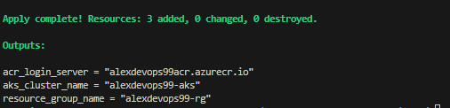
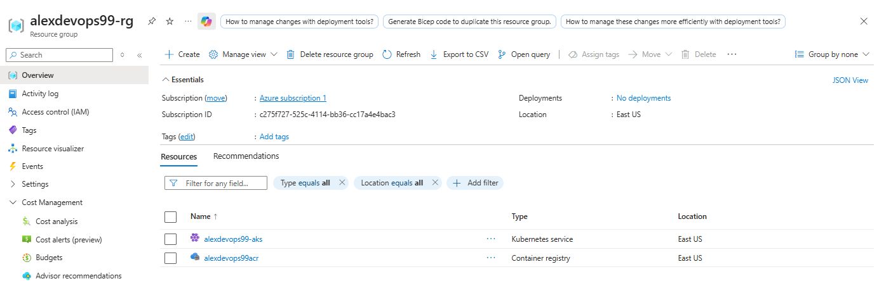
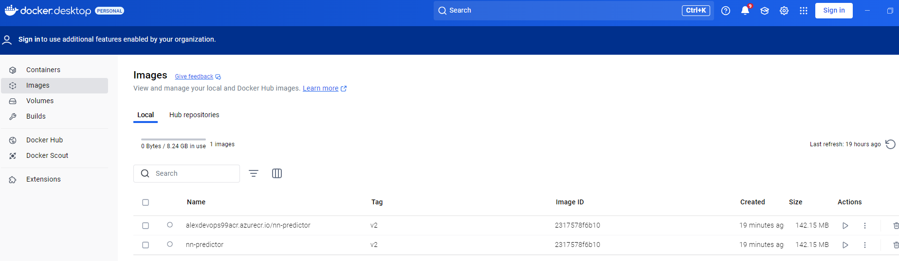
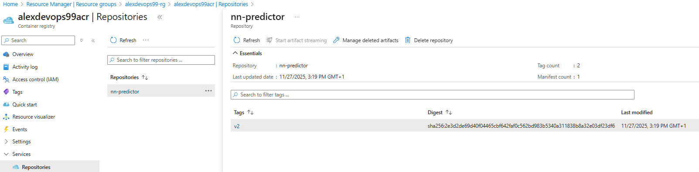
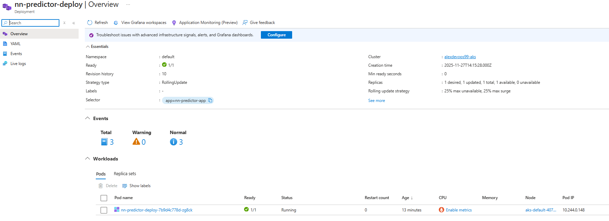
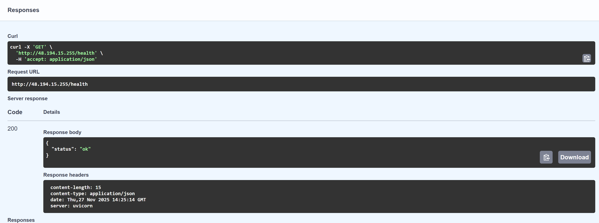

# End-to-End DevOps: Deploying FastAPI on AKS with Terraform

[](https://www.terraform.io/)
[](https://azure.microsoft.com/)
[](https://kubernetes.io/)
[](https://fastapi.tiangolo.com/)

## Project Overview

**NN Predictor** is a cloud-native demo project that showcases how to take a lightweight API from local development to a real, scalable deployment using modern DevOps practices.

The API simulates a simple **price prediction service** for **cryptocurrency (and other market) symbols** such as `BTC` or `ETH`. It exposes:
- `GET /health` for service monitoring, and
- `POST /predict` which returns a **mock predicted price** for a given `symbol`.

The “prediction” is intentionally **mocked** (not a real neural network or trading model) to keep the focus on what this repository is really about: **production-like infrastructure and deployment workflows**.

## 2. Architecture Diagram


---

## From Code to Cloud

1. **Application (FastAPI)**  
   - `GET /health`: basic health check.  
   - `POST /predict`: returns a mock “predicted” price for a given `symbol` (e.g., BTC, ETH).

2. **Containerization (Docker)**  
   - A Docker image is built from the FastAPI app and pushed to a container registry (e.g., **Azure Container Registry / ACR**).

3. **Infrastructure (Terraform)**  
   - Creates the required cloud resources (e.g., **Resource Group**, **Container Registry**, **Kubernetes cluster**).

4. **Orchestration (Kubernetes)**  
   - A **Deployment** runs the Docker image as Pods in the cluster.  
   - A **Service** of type `LoadBalancer` exposes the API on port **80** with a public IP.

---

## 3. Tech Stack

- **Backend**: Python 3.10, FastAPI, Uvicorn  
- **Containerization**: Docker  
- **Cloud**: Microsoft Azure (Resource Group, ACR, AKS)  
- **IaC**: Terraform (AzureRM provider)  
- **Orchestration**: Kubernetes (Deployment, Service)

---

## 4. Repository Structure

```text
NN-DEVOPS-CHALLENGE/
├── app/
│   ├── Dockerfile        # Docker image for the FastAPI app
│   ├── main.py           # FastAPI application (health + predict)
│   └── requirements.txt  # Python dependencies
│
├── images/               # Architecture diagram and screenshots
│   ├── architecture_overview.png       # High-level architecture (Terraform + ACR + AKS + FastAPI)
│   ├── resources_created.png           # Terraform apply output (resources created)
│   ├── azure_rg_overview.png           # Azure Resource Group overview (AKS + ACR)
│   ├── docker_images.png               # Docker Desktop: local + ACR-tagged images
│   ├── acr_repo_nn_predictor.png       # Azure Container Registry repo for nn-predictor
│   ├── aks_deployment_nn_predictor.png # AKS deployment with running pod
│   ├── fastapi_docs_health.png         # FastAPI docs – /health endpoint
│   └── fastapi_docs_predict.png        # FastAPI docs – /predict endpoint
│
├── infra/
│   ├── main.tf           # Resource Group + Azure Container Registry
│   ├── aks.tf            # Azure Kubernetes Service (AKS) cluster
│   ├── providers.tf      # Terraform provider configuration
│   ├── variables.tf      # Common variables (project_name, location)
│   └── outputs.tf        # Key outputs (RG, ACR login server, AKS name)
│
├── k8s/
│   ├── deployment.yaml   # Kubernetes Deployment (Pods and container config)
│   └── service.yaml      # Kubernetes Service (LoadBalancer, public IP)
│
├── .gitignore            # Ignore Python, Terraform and editor-specific files
└── README.md             # Project overview, architecture and documentation
```

## Screenshots

### Terraform-managed infrastructure



### Docker image


### Azure Container Registry


### AKS deployment


### FastAPI endpoints



