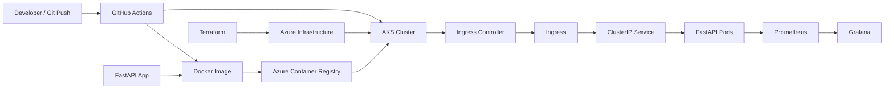
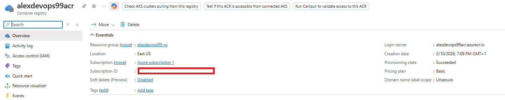
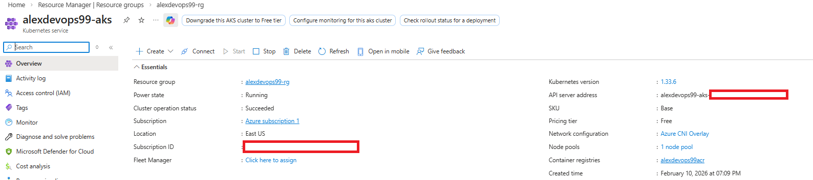
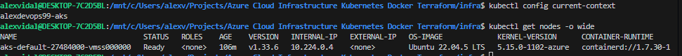
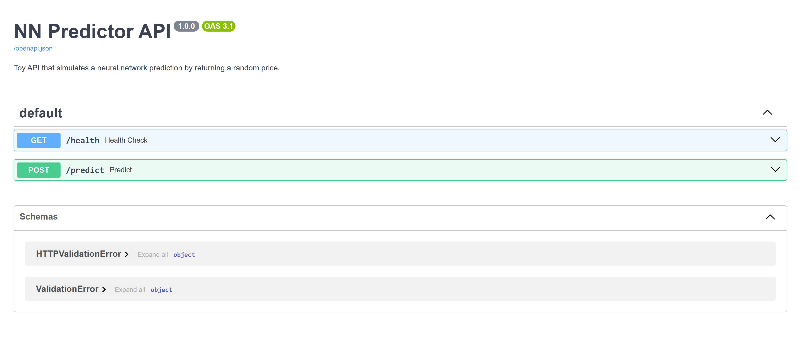
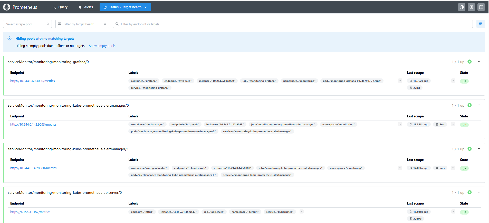
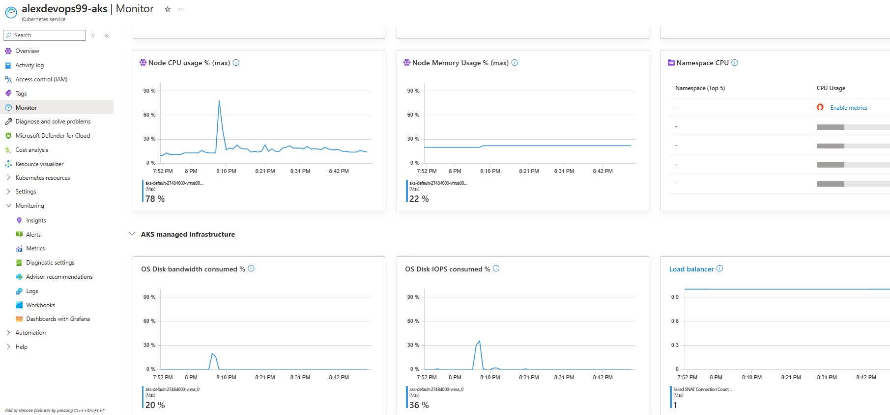

# Cloud-Native FastAPI on Azure

[](https://www.terraform.io/)
[](https://azure.microsoft.com/)
[](https://kubernetes.io/)
[](https://fastapi.tiangolo.com/)

## Overview

This repository contains a cloud-native deployment project that takes a small FastAPI application from source code to a production-style runtime on Azure.

The application itself is intentionally simple. The focus of the repository is the delivery platform around it:

- Azure infrastructure provisioned with Terraform
- Docker image build and publish to Azure Container Registry
- application runtime on Azure Kubernetes Service
- Kubernetes deployment with Ingress, autoscaling, network restrictions, and disruption controls
- CI/CD validation and deployment with GitHub Actions
- Prometheus metrics and Grafana dashboards

The project is deliberately scoped to stay coherent. Features that were not justified by the current workload were left out so the repository reflects the technologies that are actually being used.

## At a Glance

| Area | Implementation |
| --- | --- |
| Cloud | Azure Resource Group, VNet, ACR, AKS, Log Analytics |
| IaC | Modular Terraform with remote state support |
| Containerization | Dockerized FastAPI app running as non-root |
| Kubernetes | Namespace, Deployment, Service, Ingress, HPA, NetworkPolicy, PDB |
| Packaging | Raw manifests and a matching Helm chart |
| CI/CD | GitHub Actions validate and deploy workflows |
| Security | Pod Security Admission, container hardening, Trivy, Checkov |
| Observability | Prometheus metrics and Grafana dashboard |

## Architecture

### High-Level Architecture



### Runtime Request Flow

```text
Client
  -> Ingress Controller
  -> Ingress
  -> ClusterIP Service
  -> FastAPI Pod
  -> /health or /predict response
```

### Delivery Flow

```text
Push to master
  -> GitHub Actions validation workflow
  -> Docker build
  -> Trivy image scan
  -> Push image to ACR
  -> kubectl apply manifests to AKS
  -> Update Deployment image to commit SHA
  -> Wait for rollout completion
```

## Key Technical Decisions

- **Simple application, real platform concerns**
  The API is intentionally lightweight so the repository can focus on infrastructure, deployment, security, and operations.

- **Terraform modules instead of a flat root configuration**
  Azure infrastructure is split into `network`, `registry`, `aks`, and `monitoring` modules to keep concerns separated and reusable.

- **AKS with Azure CNI powered by Cilium**
  The cluster networking model is aligned with the more current AKS direction for network policy and dataplane support.

- **ClusterIP Service plus Ingress**
  The application is no longer exposed directly with a `LoadBalancer` Service. The `Service` stays internal and traffic enters through an Ingress Controller.

- **Baseline runtime hardening**
  The Deployment runs as non-root, disables privilege escalation, drops Linux capabilities, and uses Pod Security Admission in `restricted` mode.

- **Restrictive network posture**
  The application `NetworkPolicy` allows ingress only on the application port and denies all egress, because the current API does not require outbound network access.

- **Availability controls**
  The project includes an HPA for CPU-based scaling and a PDB to avoid all replicas being voluntarily disrupted at once.

- **No unnecessary platform features**
  GitOps controllers, certificate automation, databases, and tracing were intentionally left out to keep the repository focused and technically consistent.

## Repository Structure

```text
app/                FastAPI application and Dockerfile
infra/              Terraform root and modules
k8s/                Raw Kubernetes manifests
helm/nn-predictor/  Helm chart mirroring the runtime model
observability/      Prometheus, Grafana, sample dashboard
.github/workflows/  Validation and deployment pipelines
docs/screenshots/   Project screenshots
```

## Main Components

### Application

The API is implemented in [app/main.py](/c:/Users/alexv/Projects/Azure%20Cloud%20Infrastructure%20Kubernetes%20Docker%20Terraform/app/main.py).

Endpoints:

- `GET /health`
  Used by Kubernetes probes and operational checks.
- `POST /predict?symbol=BTC`
  Returns a simulated price for a symbol.
- `GET /metrics`
  Exposed for Prometheus scraping.

The business logic is intentionally minimal so the repository emphasizes cloud delivery and runtime operations rather than application complexity.

### Infrastructure

Terraform lives under [infra/](/c:/Users/alexv/Projects/Azure%20Cloud%20Infrastructure%20Kubernetes%20Docker%20Terraform/infra).

Main modules:

- `network`
  Creates the VNet and AKS subnet.
- `registry`
  Creates Azure Container Registry.
- `aks`
  Creates AKS with RBAC, authorized API access ranges, and Azure CNI powered by Cilium.
- `monitoring`
  Creates Log Analytics and monitoring-related resources.

The composition happens in [infra/main.tf](/c:/Users/alexv/Projects/Azure%20Cloud%20Infrastructure%20Kubernetes%20Docker%20Terraform/infra/main.tf), and AKS receives the `AcrPull` role assignment so the cluster can pull images from ACR.

### Kubernetes

Raw manifests live in [k8s/](/c:/Users/alexv/Projects/Azure%20Cloud%20Infrastructure%20Kubernetes%20Docker%20Terraform/k8s).

Included resources:

- [namespace.yaml](/c:/Users/alexv/Projects/Azure%20Cloud%20Infrastructure%20Kubernetes%20Docker%20Terraform/k8s/namespace.yaml)
- [deployment.yaml](/c:/Users/alexv/Projects/Azure%20Cloud%20Infrastructure%20Kubernetes%20Docker%20Terraform/k8s/deployment.yaml)
- [service.yaml](/c:/Users/alexv/Projects/Azure%20Cloud%20Infrastructure%20Kubernetes%20Docker%20Terraform/k8s/service.yaml)
- [ingress.yaml](/c:/Users/alexv/Projects/Azure%20Cloud%20Infrastructure%20Kubernetes%20Docker%20Terraform/k8s/ingress.yaml)
- [hpa.yaml](/c:/Users/alexv/Projects/Azure%20Cloud%20Infrastructure%20Kubernetes%20Docker%20Terraform/k8s/hpa.yaml)
- [networkpolicy.yaml](/c:/Users/alexv/Projects/Azure%20Cloud%20Infrastructure%20Kubernetes%20Docker%20Terraform/k8s/networkpolicy.yaml)
- [pdb.yaml](/c:/Users/alexv/Projects/Azure%20Cloud%20Infrastructure%20Kubernetes%20Docker%20Terraform/k8s/pdb.yaml)

Together, these manifests cover workload definition, service routing, external entry, scaling, network restriction, and disruption handling.

### Helm

The chart in [helm/nn-predictor/](/c:/Users/alexv/Projects/Azure%20Cloud%20Infrastructure%20Kubernetes%20Docker%20Terraform/helm/nn-predictor) mirrors the raw manifest model and provides a parameterized deployment path.

This keeps both deployment styles aligned:

- raw manifests for direct Kubernetes understanding
- Helm for reusable, configurable packaging

### CI/CD

#### Validation Workflow

[.github/workflows/validate.yml](/c:/Users/alexv/Projects/Azure%20Cloud%20Infrastructure%20Kubernetes%20Docker%20Terraform/.github/workflows/validate.yml) runs:

- `ruff`
- `pytest`
- `bandit`
- `pip-audit`
- `terraform fmt`
- `terraform validate`
- `checkov`
- optional `infracost`
- `kubeconform`
- `helm lint`

#### Deploy Workflow

[.github/workflows/deploy.yml](/c:/Users/alexv/Projects/Azure%20Cloud%20Infrastructure%20Kubernetes%20Docker%20Terraform/.github/workflows/deploy.yml) performs:

- Azure login with OIDC
- Docker image build
- Trivy image scan
- push to ACR
- namespace creation
- manifest apply
- Deployment image update to the current commit SHA
- rollout status verification

### Observability

The application exposes Prometheus metrics at `/metrics`.

Observability assets live in [observability/](/c:/Users/alexv/Projects/Azure%20Cloud%20Infrastructure%20Kubernetes%20Docker%20Terraform/observability):

- Prometheus values
- Grafana values
- sample API dashboard in [grafana-fastapi-metrics.json](/c:/Users/alexv/Projects/Azure%20Cloud%20Infrastructure%20Kubernetes%20Docker%20Terraform/observability/grafana-fastapi-metrics.json)

This gives the repository a basic but real monitoring layer instead of stopping at deployment only.

## Security Posture

The repository includes baseline controls that are justified by the current workload:

- non-root container runtime
- pod and container `securityContext`
- Pod Security Admission in `restricted` mode
- `allowPrivilegeEscalation: false`
- dropped Linux capabilities
- resource requests and limits
- `NetworkPolicy` with denied egress by default
- AKS managed identity plus `AcrPull` for image pulls
- Trivy image scanning in CI
- Checkov scanning for Terraform

## Scope Boundaries

The following are intentionally not included:

- database layer
- GitOps controller
- distributed tracing stack
- certificate automation
- extra microservices

These omissions are deliberate. The goal is to keep the repository aligned with the actual workload and avoid adding platform layers that are not currently required by the project.

## How to Run

### 1. Build and Push the Image

```bash
docker build -t <acr>.azurecr.io/fastapi-predictor:v1 app
docker push <acr>.azurecr.io/fastapi-predictor:v1
```

### 2. Provision Azure Infrastructure

```bash
cd infra
terraform init
terraform plan
terraform apply
```

### 3. Deploy to Kubernetes

```bash
kubectl apply -f k8s/namespace.yaml
kubectl apply -f k8s/
```

Prerequisite:

- an Ingress Controller such as `ingress-nginx` must already exist in the cluster

### 4. Access the Application

After the Ingress is active and the host points to the controller, the API is reachable through the configured Ingress host.

## Screenshots

The screenshots in [docs/screenshots](/c:/Users/alexv/Projects/Azure%20Cloud%20Infrastructure%20Kubernetes%20Docker%20Terraform/docs/screenshots) document the project from Azure provisioning to Kubernetes runtime and monitoring.

### Infrastructure





### Kubernetes




### CI/CD


### API




### Observability






## Author

**Alexandre Vidal**  
Email: alexvidaldepalol@gmail.com  
[LinkedIn](https://www.linkedin.com/in/alexandre-vidal-de-palol-a18538155/)  
[GitHub](https://github.com/alexvidi)
