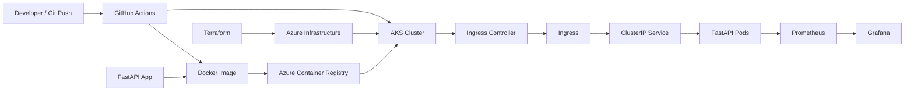

# Cloud-Native FastAPI on Azure

[](https://www.terraform.io/)
[](https://azure.microsoft.com/)
[](https://kubernetes.io/)
[](https://fastapi.tiangolo.com/)

## Project Summary

This repository is a cloud and DevOps portfolio project focused on taking a small API from local code to a production-style environment on Azure.

The application itself is intentionally simple: a small FastAPI service with `/health`, `/predict`, and `/metrics`. The real goal of the project is to demonstrate platform engineering and cloud operations skills:

- provisioning Azure infrastructure with Terraform,
- packaging the app with Docker,
- running it on AKS with Kubernetes,
- exposing it through Ingress,
- validating and deploying it with GitHub Actions,
- and observing it with Prometheus and Grafana.

This is not a machine learning project. It is a cloud-native deployment project with a small API used as the workload.

## Why I Built It

I built this project to practice and demonstrate the skills that are commonly expected in junior to junior-mid Cloud Engineer and DevOps Engineer roles:

- Infrastructure as Code
- Kubernetes operations
- CI/CD automation
- containerization
- cloud networking
- security baselines
- observability

The project scope is intentionally controlled. I removed features that were not justified by the current application, so the repository stays coherent and easy to defend in interviews.

## What the Project Demonstrates

### Skills Demonstrated

| Skill area | What is implemented in this repo |
| --- | --- |
| Azure | Resource Group, VNet, ACR, AKS, Log Analytics |
| Terraform | Modular IaC, remote state, role assignment, reusable modules |
| Docker | Dockerized FastAPI app using a non-root runtime user |
| Kubernetes | Namespace, Deployment, Service, Ingress, HPA, NetworkPolicy, PDB |
| Helm | Parameterized chart mirroring the raw Kubernetes model |
| CI/CD | GitHub Actions for validation, image build, scan, push, and deploy |
| Security | Pod Security Admission, container hardening, image scan, IaC scan |
| Observability | Prometheus metrics and Grafana dashboard |

### Delivery Flow

1. The FastAPI app is developed in `app/`.
2. Docker packages it into an image.
3. GitHub Actions builds and scans the image.
4. The image is pushed to Azure Container Registry.
5. Terraform provisions Azure infrastructure.
6. Kubernetes deploys the workload to AKS.
7. An Ingress exposes the API through an Ingress Controller.
8. Prometheus scrapes `/metrics` and Grafana visualizes the data.

## Architecture

### High-Level Architecture



### Runtime Request Flow

```text
Client
  -> Ingress Controller
  -> Ingress
  -> ClusterIP Service
  -> FastAPI Pod
  -> /health or /predict response
```

### CI/CD Flow

```text
Push to master
  -> GitHub Actions validate workflow
  -> Build Docker image
  -> Trivy image scan
  -> Push image to ACR
  -> kubectl apply manifests to AKS
  -> Update Deployment image to commit SHA
  -> Wait for rollout completion
```

## Current Stack

- Cloud: Azure
- Container registry: Azure Container Registry
- Container orchestration: Azure Kubernetes Service
- Infrastructure as Code: Terraform
- Application packaging: Docker
- Deployment model: Kubernetes manifests and Helm chart
- CI/CD: GitHub Actions
- Metrics: Prometheus
- Dashboards: Grafana

## Application

The API is implemented in [app/main.py](/c:/Users/alexv/Projects/Azure%20Cloud%20Infrastructure%20Kubernetes%20Docker%20Terraform/app/main.py).

Endpoints:

- `GET /health`
  Used by Kubernetes probes and operational checks.
- `POST /predict?symbol=BTC`
  Returns a simulated price for a symbol.
- `GET /metrics`
  Exposed for Prometheus scraping.

The business logic is intentionally minimal. This keeps the focus on cloud infrastructure, delivery, and operations rather than on application complexity.

## Infrastructure

Terraform is organized by modules under [infra/](/c:/Users/alexv/Projects/Azure%20Cloud%20Infrastructure%20Kubernetes%20Docker%20Terraform/infra):

- `network`
  Creates the VNet and AKS subnet.
- `registry`
  Creates ACR.
- `aks`
  Creates AKS with Azure CNI powered by Cilium, RBAC, and authorized API access ranges.
- `monitoring`
  Creates Log Analytics and monitoring-related resources.

The composition happens in [infra/main.tf](/c:/Users/alexv/Projects/Azure%20Cloud%20Infrastructure%20Kubernetes%20Docker%20Terraform/infra/main.tf), and AKS receives `AcrPull` permissions so the cluster can pull images from ACR.

### Why the infrastructure layout matters

This structure shows that I can:

- split Terraform by concern instead of keeping a monolithic file,
- use remote state,
- wire modules together cleanly,
- and keep Azure infrastructure understandable and maintainable.

## Kubernetes Design

The raw manifests live in [k8s/](/c:/Users/alexv/Projects/Azure%20Cloud%20Infrastructure%20Kubernetes%20Docker%20Terraform/k8s).

### Resources included

- [namespace.yaml](/c:/Users/alexv/Projects/Azure%20Cloud%20Infrastructure%20Kubernetes%20Docker%20Terraform/k8s/namespace.yaml)
  Dedicated namespace with Pod Security Admission in `restricted` mode.
- [deployment.yaml](/c:/Users/alexv/Projects/Azure%20Cloud%20Infrastructure%20Kubernetes%20Docker%20Terraform/k8s/deployment.yaml)
  Defines replicas, probes, resources, image, and container hardening.
- [service.yaml](/c:/Users/alexv/Projects/Azure%20Cloud%20Infrastructure%20Kubernetes%20Docker%20Terraform/k8s/service.yaml)
  Internal `ClusterIP` service used by the Ingress.
- [ingress.yaml](/c:/Users/alexv/Projects/Azure%20Cloud%20Infrastructure%20Kubernetes%20Docker%20Terraform/k8s/ingress.yaml)
  Exposes the API through an Ingress Controller.
- [hpa.yaml](/c:/Users/alexv/Projects/Azure%20Cloud%20Infrastructure%20Kubernetes%20Docker%20Terraform/k8s/hpa.yaml)
  Scales the deployment based on CPU utilization.
- [networkpolicy.yaml](/c:/Users/alexv/Projects/Azure%20Cloud%20Infrastructure%20Kubernetes%20Docker%20Terraform/k8s/networkpolicy.yaml)
  Allows ingress only on the app port and denies all egress.
- [pdb.yaml](/c:/Users/alexv/Projects/Azure%20Cloud%20Infrastructure%20Kubernetes%20Docker%20Terraform/k8s/pdb.yaml)
  Keeps at least one pod available during voluntary disruptions.

### Why these manifests matter

They show that I understand more than just "run a container in Kubernetes". The repo includes:

- workload definition,
- internal service discovery,
- external traffic entry,
- autoscaling,
- network restrictions,
- availability controls,
- and basic runtime hardening.

## Helm

The chart in [helm/nn-predictor/](/c:/Users/alexv/Projects/Azure%20Cloud%20Infrastructure%20Kubernetes%20Docker%20Terraform/helm/nn-predictor) mirrors the raw manifest model and provides a parameterized deployment path.

This demonstrates that I understand both:

- raw Kubernetes manifests,
- and a reusable packaging model with Helm.

## CI/CD

### Validation Workflow

[.github/workflows/validate.yml](/c:/Users/alexv/Projects/Azure%20Cloud%20Infrastructure%20Kubernetes%20Docker%20Terraform/.github/workflows/validate.yml) runs:

- `ruff`
- `pytest`
- `bandit`
- `pip-audit`
- `terraform fmt` and `terraform validate`
- `checkov`
- optional `infracost`
- `kubeconform`
- `helm lint`

### Deploy Workflow

[.github/workflows/deploy.yml](/c:/Users/alexv/Projects/Azure%20Cloud%20Infrastructure%20Kubernetes%20Docker%20Terraform/.github/workflows/deploy.yml) does the following:

- logs into Azure with OIDC,
- builds the Docker image,
- scans it with Trivy,
- pushes it to ACR,
- applies the Kubernetes manifests,
- updates the Deployment to the current commit SHA,
- waits for rollout completion.

### Why this matters

This shows practical CI/CD, not just local deployment. It demonstrates:

- build automation,
- image security scanning,
- cloud authentication with OIDC,
- and Kubernetes rollout orchestration.

## Security Decisions

The project includes baseline security controls that are justified by the current application:

- the container runs as a non-root user,
- pod and container `securityContext` are applied,
- Pod Security Admission is enabled at namespace level,
- `allowPrivilegeEscalation` is disabled,
- Linux capabilities are dropped,
- resource requests and limits are defined,
- egress is denied by default in the app `NetworkPolicy`,
- image pull uses AKS managed identity plus `AcrPull`,
- the image is scanned in CI with Trivy,
- the Terraform is scanned with Checkov.

I intentionally removed pieces that were not justified by the current app, such as extra secret-management runtime layers that the API did not actually need.

## Observability

The project includes metrics and dashboards:

- the FastAPI app exposes Prometheus metrics at `/metrics`,
- Prometheus scrapes the app,
- Grafana dashboards visualize runtime behavior,
- a sample API dashboard is provided in [observability/grafana-fastapi-metrics.json](/c:/Users/alexv/Projects/Azure%20Cloud%20Infrastructure%20Kubernetes%20Docker%20Terraform/observability/grafana-fastapi-metrics.json).

This gives the project a basic but real observability layer instead of stopping at deployment only.

## Scope Decisions

Some things are intentionally not included:

- no database,
- no GitOps controller,
- no distributed tracing stack,
- no certificate automation,
- no extra microservices.

I made those choices on purpose to keep the repository coherent, realistic for my current level, and easy to explain clearly in interviews.

## Repository Structure

```text
app/                FastAPI application and Dockerfile
infra/              Terraform root and modules
k8s/                Raw Kubernetes manifests
helm/nn-predictor/  Helm chart mirroring the runtime model
observability/      Prometheus, Grafana, sample dashboard
.github/workflows/  Validation and deployment pipelines
docs/screenshots/   Project screenshots
```

## How to Run It

### 1. Build and push the image

```bash
docker build -t <acr>.azurecr.io/fastapi-predictor:v1 app
docker push <acr>.azurecr.io/fastapi-predictor:v1
```

### 2. Provision Azure infrastructure

```bash
cd infra
terraform init
terraform plan
terraform apply
```

### 3. Deploy to Kubernetes

```bash
kubectl apply -f k8s/namespace.yaml
kubectl apply -f k8s/
```

Prerequisite:

- an Ingress Controller such as `ingress-nginx` must already exist in the cluster.

### 4. Access the app

After the Ingress is active and the host points to the controller, the API is reachable through the configured Ingress host.

## Screenshots

The screenshots in [docs/screenshots](/c:/Users/alexv/Projects/Azure%20Cloud%20Infrastructure%20Kubernetes%20Docker%20Terraform/docs/screenshots) document the end-to-end flow from Azure provisioning to Kubernetes runtime and monitoring.

### Infrastructure


### Kubernetes


### CI/CD


### API


### Observability


## What I Would Explain in an Interview

If I presented this project in an interview, I would focus on these points:

1. I used a deliberately simple application so I could focus on cloud and platform engineering decisions.
2. I provisioned Azure infrastructure with modular Terraform instead of doing it manually.
3. I containerized the app and deployed it to AKS with Kubernetes primitives that solve real operational concerns.
4. I added CI/CD, security scans, autoscaling, networking controls, and observability.
5. I kept the project coherent by removing features that were not justified by the workload.

## Author

**Alexandre Vidal**  
Email: alexvidaldepalol@gmail.com  
[LinkedIn](https://www.linkedin.com/in/alexandre-vidal-de-palol-a18538155/)  
[GitHub](https://github.com/alexvidi)
