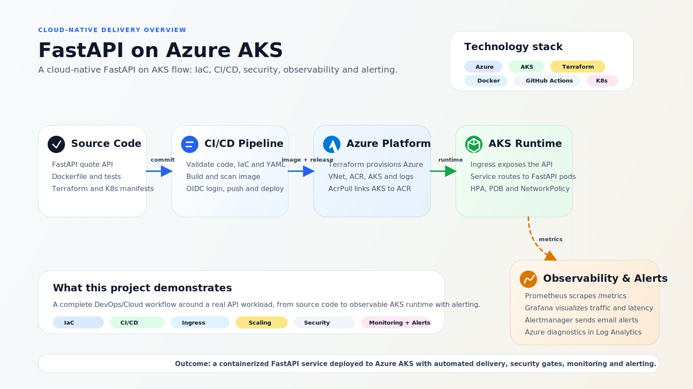
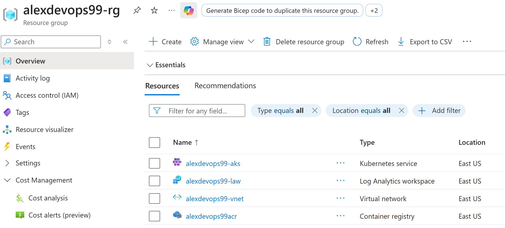
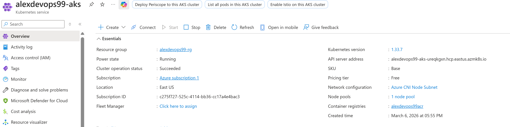
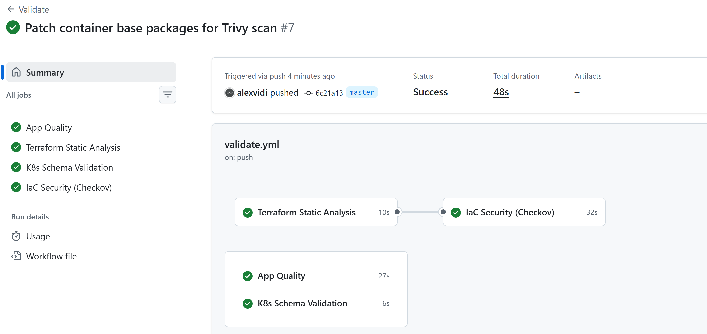
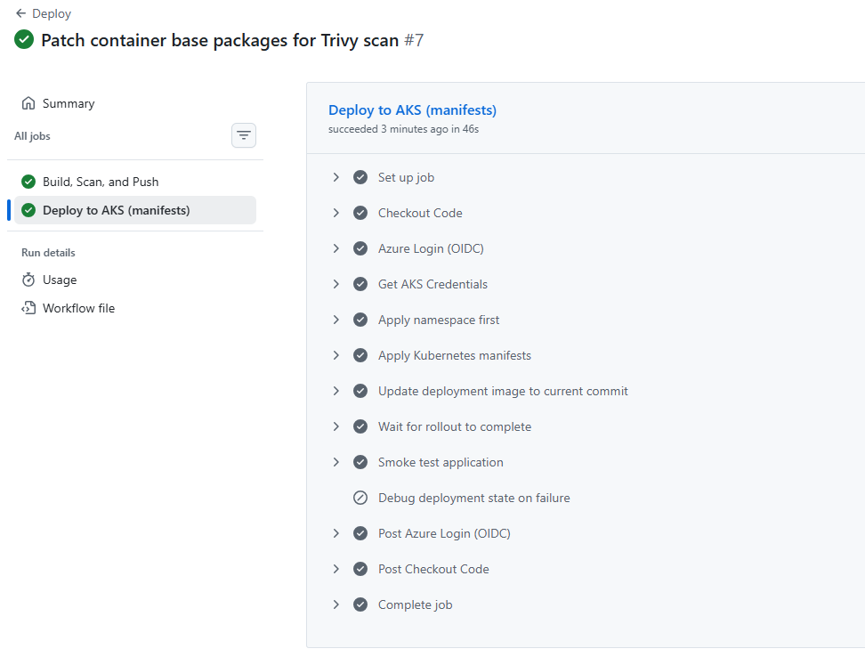
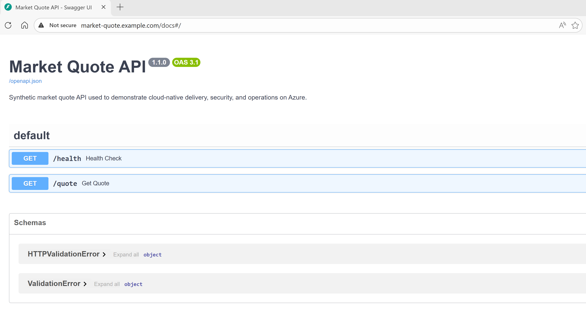
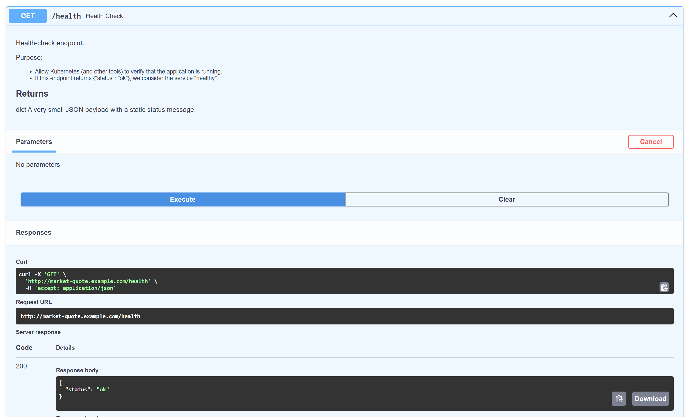
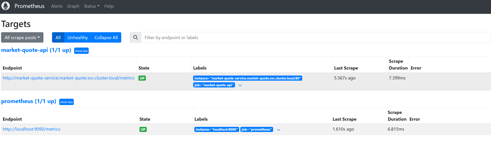
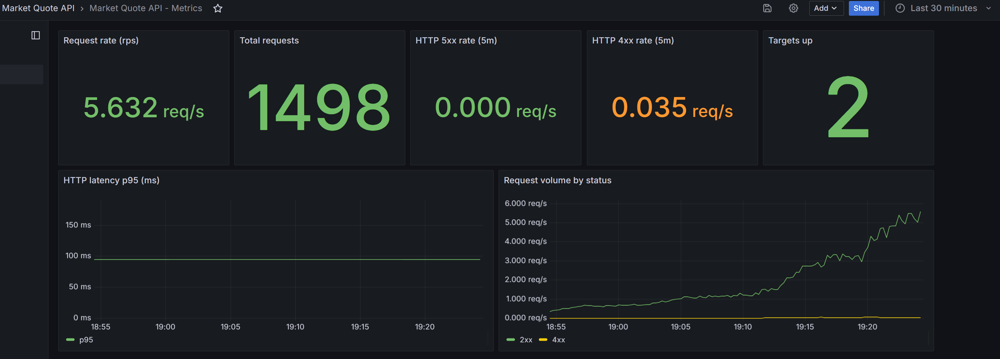

# FastAPI on Azure with Terraform, AKS, and GitHub Actions

[](https://www.terraform.io/)
[](https://azure.microsoft.com/)
[](https://kubernetes.io/)
[](https://fastapi.tiangolo.com/)

## Overview

This repository contains a cloud-native deployment project that takes a small FastAPI market quote service from source code to a production-style runtime on Azure.

The application itself is intentionally simple. The focus of the repository is the delivery platform around it:

- Azure infrastructure provisioned with Terraform
- Docker image build and publish to Azure Container Registry
- application runtime on Azure Kubernetes Service
- Kubernetes deployment with Ingress, autoscaling, network restrictions, and disruption controls
- CI/CD validation and deployment with GitHub Actions
- Prometheus metrics and Grafana dashboards

The project is deliberately scoped to stay coherent. Features that were not justified by the current workload were left out so the repository reflects the technologies that are actually being used.

## At a Glance

| Area | Implementation |
| --- | --- |
| Cloud | Azure Resource Group, VNet, ACR, AKS, Log Analytics |
| IaC | Modular Terraform with remote state support |
| Containerization | Dockerized FastAPI app running as non-root |
| Kubernetes | Namespace, Deployment, Service, Ingress, HPA, NetworkPolicy, PDB, raw monitoring manifests |
| Packaging | Raw Kubernetes manifests |
| CI/CD | GitHub Actions validate and deploy workflows |
| Security | Pod Security Admission, container hardening, Trivy, Checkov |
| Observability | Prometheus + Grafana via raw Kubernetes manifests |

## Architecture

### High-Level Architecture



### Runtime Request Flow

```text
Client
  -> Ingress Controller
  -> Ingress
  -> ClusterIP Service
  -> FastAPI Pod
  -> /health or /quote response
```

### Delivery Flow

```text
Push to master
  -> GitHub Actions Validate workflow
  -> GitHub Actions Deploy workflow when infrastructure is active

Deploy workflow
  -> Docker build
  -> Trivy image scan
  -> Push image to ACR
  -> kubectl apply manifests to AKS
  -> Update Deployment image to commit SHA
  -> Wait for rollout completion
  -> Smoke test /health and /quote
```

## Key Technical Decisions

- **Simple application, real platform concerns**
  The API is intentionally lightweight so the repository can focus on infrastructure, deployment, security, and operations.

- **Terraform modules instead of a flat root configuration**
  Azure infrastructure is split into `network`, `registry`, `aks`, and `monitoring` modules to keep concerns separated and reusable.

- **AKS with Azure CNI powered by Cilium**
  The cluster networking model is aligned with the more current AKS direction for network policy and dataplane support.

- **ClusterIP Service plus Ingress**
  The application uses a `ClusterIP` Service behind an Ingress Controller. The `Service` stays internal and traffic enters through ingress. The current manifest omits a fixed host so the demo works through the ingress public IP without requiring local DNS edits.

- **Baseline runtime hardening**
  The Deployment runs as non-root, disables privilege escalation, drops Linux capabilities, and uses Pod Security Admission in `restricted` mode.

- **Restrictive network posture**
  The application `NetworkPolicy` allows ingress only from the `ingress-nginx` and `monitoring` namespaces on the application port, and denies all egress because the current API does not require outbound network access.

- **Availability controls**
  The project includes an HPA for CPU-based scaling and a PDB to avoid all replicas being voluntarily disrupted at once.

- **No unnecessary platform features**
  GitOps controllers, certificate automation, databases, and tracing were intentionally left out to keep the repository focused and technically consistent.

## Repository Structure

```text
app/                FastAPI application and Dockerfile
infra/              Terraform root and modules
k8s/                Raw Kubernetes manifests
.github/workflows/  Validation and deployment pipelines
docs/screenshots/   Project screenshots
```

## Main Components

### Application

The API is implemented in [app/main.py](app/main.py).

Endpoints:

- `GET /health`
  Used by Kubernetes probes and operational checks.
- `GET /quote?symbol=BTC`
  Returns a synthetic market quote for a supported symbol.
- `GET /metrics`
  Exposed for Prometheus scraping.

The business logic is intentionally lightweight and explicit. The API returns synthetic quotes for a small supported symbol set so the repository can emphasize cloud delivery and runtime operations.

### Infrastructure

Terraform lives under [infra/](infra).

Main modules:

- `network`
  Creates the VNet and AKS subnet.
- `registry`
  Creates Azure Container Registry.
- `aks`
  Creates AKS with RBAC, authorized API access ranges, and Azure CNI powered by Cilium.
- `monitoring`
  Creates Log Analytics and monitoring-related resources.

The composition happens in [infra/main.tf](infra/main.tf), and AKS receives the `AcrPull` role assignment so the cluster can pull images from ACR.

### Kubernetes

Raw manifests live in [k8s/](k8s).

Included resources:

- [namespace.yaml](k8s/namespace.yaml)
- [deployment.yaml](k8s/deployment.yaml)
- [service.yaml](k8s/service.yaml)
- [ingress.yaml](k8s/ingress.yaml)
- [hpa.yaml](k8s/hpa.yaml)
- [networkpolicy.yaml](k8s/networkpolicy.yaml)
- [pdb.yaml](k8s/pdb.yaml)
- [monitoring-namespace.yaml](k8s/monitoring-namespace.yaml)
- [prometheus-config.yaml](k8s/prometheus-config.yaml)
- [prometheus.yaml](k8s/prometheus.yaml)
- [grafana-config.yaml](k8s/grafana-config.yaml)
- [grafana.yaml](k8s/grafana.yaml)

Together, these manifests cover workload definition, service routing, external entry, scaling, network restriction, disruption handling, and a lightweight monitoring stack. Grafana admin credentials are intentionally created outside the repo as a Kubernetes Secret.

### CI/CD

#### Validation Workflow

[.github/workflows/validate.yml](.github/workflows/validate.yml) runs:

- `ruff`
- `pytest`
- `bandit`
- `pip-audit`
- `terraform fmt`
- `terraform validate`
- `checkov`
- `kubeconform`

Note:

- `Validate` and `Deploy` remain separate workflows so validation and delivery stay cleanly separated
- `Deploy` now runs after a successful `Validate` workflow on `master`
- in a production repository, I would still pair this with branch protection so `Validate` must pass before merge to `master`

#### Deploy Workflow

[.github/workflows/deploy.yml](.github/workflows/deploy.yml) performs:

- Azure login with OIDC
- Docker image build
- Trivy image scan
- push to ACR
- namespace creation for both workload and monitoring
- Grafana admin secret creation from GitHub Actions secrets
- manifest apply
- Deployment image update to the validated commit SHA
- rollout status verification
- post-deploy smoke test against `/health` and `/quote` on the Kubernetes Service
- failure diagnostics with `kubectl get`, `describe`, and application logs

Note:

- the Deployment manifest keeps a default image reference for direct `kubectl apply` usage
- the GitHub Actions deploy workflow overrides that image with the validated commit SHA during CI/CD

### Observability

The application exposes Prometheus metrics at `/metrics`.

The monitoring stack is deployed with raw manifests in [k8s/monitoring-namespace.yaml](k8s/monitoring-namespace.yaml), [k8s/prometheus-config.yaml](k8s/prometheus-config.yaml), [k8s/prometheus.yaml](k8s/prometheus.yaml), [k8s/grafana-config.yaml](k8s/grafana-config.yaml), and [k8s/grafana.yaml](k8s/grafana.yaml).

Grafana admin credentials are not committed to the repository. In CI/CD, the deploy workflow creates the `grafana-admin` Secret from the `GRAFANA_ADMIN_USER` and `GRAFANA_ADMIN_PASSWORD` GitHub secrets. For direct `kubectl` usage, create that Secret manually before applying the manifests.

This gives the repository a basic but real monitoring layer instead of stopping at deployment only.

## Security Posture

The repository includes baseline controls that are justified by the current workload:

- non-root container runtime
- pod and container `securityContext`
- Pod Security Admission in `restricted` mode
- `allowPrivilegeEscalation: false`
- dropped Linux capabilities
- resource requests and limits
- `NetworkPolicy` with denied egress by default
- AKS managed identity plus `AcrPull` for image pulls
- Grafana admin credentials externalized into a Kubernetes Secret
- Trivy image scanning in CI
- Checkov scanning for Terraform

## How to Run

### 1. Build and Push the Image

```bash
docker build -t <acr>.azurecr.io/market-quote-api:v1 app
docker push <acr>.azurecr.io/market-quote-api:v1
```

### 2. Provision Azure Infrastructure

```bash
cd infra
terraform init
terraform plan
terraform apply
```

### 3. Deploy to Kubernetes

```bash
kubectl apply -f k8s/namespace.yaml
kubectl apply -f k8s/monitoring-namespace.yaml
kubectl create secret generic grafana-admin \
  -n monitoring \
  --from-literal=admin-user=admin \
  --from-literal=admin-password='<strong-password>' \
  --dry-run=client -o yaml | kubectl apply -f -
kubectl apply -f k8s/
```

Prerequisite:

- an Ingress Controller such as `ingress-nginx` must already exist in the cluster
- the current `NetworkPolicy` assumes the ingress controller runs in the `ingress-nginx` namespace; adjust the namespace selector if your installation uses another namespace
- direct `kubectl apply` uses the default image reference defined in `k8s/deployment.yaml`
- the CI/CD workflow updates that image to the validated commit SHA after applying the manifests
- the CI/CD workflow also creates the `grafana-admin` Secret from GitHub Actions secrets before applying manifests
- the raw monitoring stack is included in the `k8s/monitoring-*.yaml`, `k8s/prometheus*.yaml`, and `k8s/grafana*.yaml` manifests and deploys into the `monitoring` namespace

### 4. Access the Application

After the Ingress is active, the API is reachable through the ingress controller public IP. If you want a friendly hostname, add a DNS record and an optional TLS block to `k8s/ingress.yaml`.

### 5. Access Observability

Prometheus and Grafana are deployed into the `monitoring` namespace by the raw monitoring manifests under `k8s/`.

To access them locally:

```bash
kubectl port-forward -n monitoring svc/prometheus-server 9090:9090
kubectl port-forward -n monitoring svc/grafana 3000:3000
```

Then open:

- `http://127.0.0.1:9090` for Prometheus
- `http://127.0.0.1:3000` for Grafana

Grafana uses the credentials stored in the `grafana-admin` Secret.

## Screenshots

The screenshots in [docs/screenshots](docs/screenshots) document a successful end-to-end Azure run of the project before the cloud resources were deprovisioned to control costs.

### Infrastructure


The resource group screenshot shows the core Azure resources created for the project, including AKS, ACR, networking, and Log Analytics.


The AKS overview confirms the managed cluster was provisioned successfully and linked to the container registry used by the deployment pipeline.

### CI/CD


This run shows the validation workflow passing application checks, Terraform validation, Kubernetes schema validation, and IaC security scanning.


This deploy run shows the image build, registry push, manifest rollout, and post-deploy smoke test completing successfully.

### API


The Swagger UI screenshot confirms the API was reachable through the Kubernetes ingress from a browser.


The quote response screenshot shows the main business endpoint returning the expected JSON contract for a supported symbol.

### Observability


The Prometheus targets page shows the application metrics endpoint being scraped successfully from inside the cluster.


The Grafana dashboard shows live request rate, latency, and status-code metrics collected from the running application.

## Author

**Alexandre Vidal**  
Email: alexvidaldepalol@gmail.com  
[LinkedIn](https://www.linkedin.com/in/alexandre-vidal-de-palol-a18538155/)  
[GitHub](https://github.com/alexvidi)
