# Cloud-Native FastAPI on Azure

[](https://www.terraform.io/)
[](https://azure.microsoft.com/)
[](https://kubernetes.io/)
[](https://fastapi.tiangolo.com/)

## Overview

This repository contains a cloud-native deployment project that takes a small FastAPI market quote service from source code to a production-style runtime on Azure.

The application itself is intentionally simple. The focus of the repository is the delivery platform around it:

- Azure infrastructure provisioned with Terraform
- Docker image build and publish to Azure Container Registry
- application runtime on Azure Kubernetes Service
- Kubernetes deployment with Ingress, autoscaling, network restrictions, and disruption controls
- CI/CD validation and deployment with GitHub Actions
- Prometheus metrics and Grafana dashboards

The project is deliberately scoped to stay coherent. Features that were not justified by the current workload were left out so the repository reflects the technologies that are actually being used.

## At a Glance

| Area | Implementation |
| --- | --- |
| Cloud | Azure Resource Group, VNet, ACR, AKS, Log Analytics |
| IaC | Modular Terraform with remote state support |
| Containerization | Dockerized FastAPI app running as non-root |
| Kubernetes | Namespace, Deployment, Service, Ingress, HPA, NetworkPolicy, PDB, raw monitoring manifests |
| Packaging | Raw Kubernetes manifests |
| CI/CD | GitHub Actions validate and deploy workflows |
| Security | Pod Security Admission, container hardening, Trivy, Checkov |
| Observability | Prometheus + Grafana via raw Kubernetes manifests |

## Architecture

### High-Level Architecture

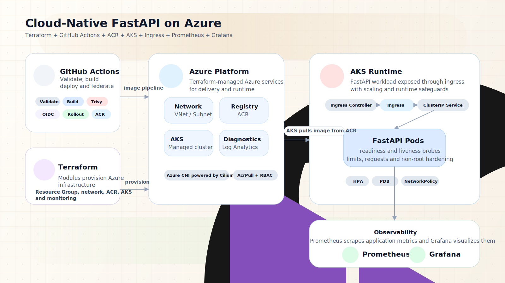

### Runtime Request Flow

```text
Client
  -> Ingress Controller
  -> Ingress
  -> ClusterIP Service
  -> FastAPI Pod
  -> /health or /quote response
```

### Delivery Flow

```text
Push to master
  -> GitHub Actions Validate workflow
  -> GitHub Actions Deploy workflow

Deploy workflow
  -> Docker build
  -> Trivy image scan
  -> Push image to ACR
  -> kubectl apply manifests to AKS
  -> Update Deployment image to commit SHA
  -> Wait for rollout completion
  -> Smoke test /health and /quote
```

## Key Technical Decisions

- **Simple application, real platform concerns**
  The API is intentionally lightweight so the repository can focus on infrastructure, deployment, security, and operations.

- **Terraform modules instead of a flat root configuration**
  Azure infrastructure is split into `network`, `registry`, `aks`, and `monitoring` modules to keep concerns separated and reusable.

- **AKS with Azure CNI powered by Cilium**
  The cluster networking model is aligned with the more current AKS direction for network policy and dataplane support.

- **ClusterIP Service plus Ingress**
  The application is no longer exposed directly with a `LoadBalancer` Service. The `Service` stays internal and traffic enters through an Ingress Controller.

- **Baseline runtime hardening**
  The Deployment runs as non-root, disables privilege escalation, drops Linux capabilities, and uses Pod Security Admission in `restricted` mode.

- **Restrictive network posture**
  The application `NetworkPolicy` allows ingress only on the application port and denies all egress, because the current API does not require outbound network access.

- **Availability controls**
  The project includes an HPA for CPU-based scaling and a PDB to avoid all replicas being voluntarily disrupted at once.

- **No unnecessary platform features**
  GitOps controllers, certificate automation, databases, and tracing were intentionally left out to keep the repository focused and technically consistent.

## Repository Structure

```text
app/                FastAPI application and Dockerfile
infra/              Terraform root and modules
k8s/                Raw Kubernetes manifests
observability/      Prometheus, Grafana, sample dashboard
.github/workflows/  Validation and deployment pipelines
docs/screenshots/   Project screenshots
```

## Main Components

### Application

The API is implemented in [app/main.py](/c:/Users/alexv/Projects/Azure%20Cloud%20Infrastructure%20Kubernetes%20Docker%20Terraform/app/main.py).

Endpoints:

- `GET /health`
  Used by Kubernetes probes and operational checks.
- `GET /quote?symbol=BTC`
  Returns a synthetic market quote for a supported symbol.
- `GET /metrics`
  Exposed for Prometheus scraping.

The business logic is intentionally lightweight and honest. Instead of pretending to be a real machine learning system, the API returns synthetic quotes for a small supported symbol set so the repository can emphasize cloud delivery and runtime operations.

### Infrastructure

Terraform lives under [infra/](/c:/Users/alexv/Projects/Azure%20Cloud%20Infrastructure%20Kubernetes%20Docker%20Terraform/infra).

Main modules:

- `network`
  Creates the VNet and AKS subnet.
- `registry`
  Creates Azure Container Registry.
- `aks`
  Creates AKS with RBAC, authorized API access ranges, and Azure CNI powered by Cilium.
- `monitoring`
  Creates Log Analytics and monitoring-related resources.

The composition happens in [infra/main.tf](/c:/Users/alexv/Projects/Azure%20Cloud%20Infrastructure%20Kubernetes%20Docker%20Terraform/infra/main.tf), and AKS receives the `AcrPull` role assignment so the cluster can pull images from ACR.

### Kubernetes

Raw manifests live in [k8s/](/c:/Users/alexv/Projects/Azure%20Cloud%20Infrastructure%20Kubernetes%20Docker%20Terraform/k8s).

Included resources:

- [namespace.yaml](/c:/Users/alexv/Projects/Azure%20Cloud%20Infrastructure%20Kubernetes%20Docker%20Terraform/k8s/namespace.yaml)
- [deployment.yaml](/c:/Users/alexv/Projects/Azure%20Cloud%20Infrastructure%20Kubernetes%20Docker%20Terraform/k8s/deployment.yaml)
- [service.yaml](/c:/Users/alexv/Projects/Azure%20Cloud%20Infrastructure%20Kubernetes%20Docker%20Terraform/k8s/service.yaml)
- [ingress.yaml](/c:/Users/alexv/Projects/Azure%20Cloud%20Infrastructure%20Kubernetes%20Docker%20Terraform/k8s/ingress.yaml)
- [hpa.yaml](/c:/Users/alexv/Projects/Azure%20Cloud%20Infrastructure%20Kubernetes%20Docker%20Terraform/k8s/hpa.yaml)
- [networkpolicy.yaml](/c:/Users/alexv/Projects/Azure%20Cloud%20Infrastructure%20Kubernetes%20Docker%20Terraform/k8s/networkpolicy.yaml)
- [pdb.yaml](/c:/Users/alexv/Projects/Azure%20Cloud%20Infrastructure%20Kubernetes%20Docker%20Terraform/k8s/pdb.yaml)
- [monitoring-namespace.yaml](/c:/Users/alexv/Projects/Azure%20Cloud%20Infrastructure%20Kubernetes%20Docker%20Terraform/k8s/monitoring-namespace.yaml)
- [prometheus-config.yaml](/c:/Users/alexv/Projects/Azure%20Cloud%20Infrastructure%20Kubernetes%20Docker%20Terraform/k8s/prometheus-config.yaml)
- [prometheus.yaml](/c:/Users/alexv/Projects/Azure%20Cloud%20Infrastructure%20Kubernetes%20Docker%20Terraform/k8s/prometheus.yaml)
- [grafana-config.yaml](/c:/Users/alexv/Projects/Azure%20Cloud%20Infrastructure%20Kubernetes%20Docker%20Terraform/k8s/grafana-config.yaml)
- [grafana.yaml](/c:/Users/alexv/Projects/Azure%20Cloud%20Infrastructure%20Kubernetes%20Docker%20Terraform/k8s/grafana.yaml)

Together, these manifests cover workload definition, service routing, external entry, scaling, network restriction, disruption handling, and a lightweight monitoring stack.

### CI/CD

#### Validation Workflow

[.github/workflows/validate.yml](/c:/Users/alexv/Projects/Azure%20Cloud%20Infrastructure%20Kubernetes%20Docker%20Terraform/.github/workflows/validate.yml) runs:

- `ruff`
- `pytest`
- `bandit`
- `pip-audit`
- `terraform fmt`
- `terraform validate`
- `checkov`
- `kubeconform`

Note:

- `Validate` and `Deploy` are separate workflows in this repository
- a push to `master` can trigger both workflows independently
- the deploy workflow is not currently blocked by validate workflow completion

#### Deploy Workflow

[.github/workflows/deploy.yml](/c:/Users/alexv/Projects/Azure%20Cloud%20Infrastructure%20Kubernetes%20Docker%20Terraform/.github/workflows/deploy.yml) performs:

- Azure login with OIDC
- Docker image build
- Trivy image scan
- push to ACR
- namespace creation
- manifest apply
- Deployment image update to the current commit SHA
- rollout status verification
- post-deploy smoke test against `/health` and `/quote` on the Kubernetes Service
- failure diagnostics with `kubectl get`, `describe`, and application logs

Note:

- the Deployment manifest keeps a default image reference for direct `kubectl apply` usage
- the GitHub Actions deploy workflow overrides that image with the current commit SHA during CI/CD

### Observability

The application exposes Prometheus metrics at `/metrics`.

The monitoring stack is deployed with raw manifests in [k8s/monitoring-namespace.yaml](/c:/Users/alexv/Projects/Azure%20Cloud%20Infrastructure%20Kubernetes%20Docker%20Terraform/k8s/monitoring-namespace.yaml), [k8s/prometheus-config.yaml](/c:/Users/alexv/Projects/Azure%20Cloud%20Infrastructure%20Kubernetes%20Docker%20Terraform/k8s/prometheus-config.yaml), [k8s/prometheus.yaml](/c:/Users/alexv/Projects/Azure%20Cloud%20Infrastructure%20Kubernetes%20Docker%20Terraform/k8s/prometheus.yaml), [k8s/grafana-config.yaml](/c:/Users/alexv/Projects/Azure%20Cloud%20Infrastructure%20Kubernetes%20Docker%20Terraform/k8s/grafana-config.yaml), and [k8s/grafana.yaml](/c:/Users/alexv/Projects/Azure%20Cloud%20Infrastructure%20Kubernetes%20Docker%20Terraform/k8s/grafana.yaml).

Supporting observability assets remain in [observability/](/c:/Users/alexv/Projects/Azure%20Cloud%20Infrastructure%20Kubernetes%20Docker%20Terraform/observability):

- source dashboard in [grafana-fastapi-metrics.json](/c:/Users/alexv/Projects/Azure%20Cloud%20Infrastructure%20Kubernetes%20Docker%20Terraform/observability/grafana-fastapi-metrics.json)

This gives the repository a basic but real monitoring layer instead of stopping at deployment only.

## Security Posture

The repository includes baseline controls that are justified by the current workload:

- non-root container runtime
- pod and container `securityContext`
- Pod Security Admission in `restricted` mode
- `allowPrivilegeEscalation: false`
- dropped Linux capabilities
- resource requests and limits
- `NetworkPolicy` with denied egress by default
- AKS managed identity plus `AcrPull` for image pulls
- Trivy image scanning in CI
- Checkov scanning for Terraform

## How to Run

### 1. Build and Push the Image

```bash
docker build -t <acr>.azurecr.io/market-quote-api:v1 app
docker push <acr>.azurecr.io/market-quote-api:v1
```

### 2. Provision Azure Infrastructure

```bash
cd infra
terraform init
terraform plan
terraform apply
```

### 3. Deploy to Kubernetes

```bash
kubectl apply -f k8s/namespace.yaml
kubectl apply -f k8s/
```

Prerequisite:

- an Ingress Controller such as `ingress-nginx` must already exist in the cluster
- direct `kubectl apply` uses the default image reference defined in `k8s/deployment.yaml`
- the CI/CD workflow updates that image to the current commit SHA after applying the manifests
- the raw monitoring stack is included in the `k8s/monitoring-*.yaml`, `k8s/prometheus*.yaml`, and `k8s/grafana*.yaml` manifests and deploys into the `monitoring` namespace

### 4. Access the Application

After the Ingress is active and the host points to the controller, the API is reachable through the configured Ingress host.

### 5. Access Observability

Prometheus and Grafana are deployed into the `monitoring` namespace by the raw monitoring manifests under `k8s/`.

To access them locally:

```bash
kubectl port-forward -n monitoring svc/prometheus-server 9090:9090
kubectl port-forward -n monitoring svc/grafana 3000:3000
```

Then open:

- `http://127.0.0.1:9090` for Prometheus
- `http://127.0.0.1:3000` for Grafana

Grafana demo credentials:

- username: `admin`
- password: `admin`

## Screenshots

The screenshots in [docs/screenshots](/c:/Users/alexv/Projects/Azure%20Cloud%20Infrastructure%20Kubernetes%20Docker%20Terraform/docs/screenshots) document the project from Azure provisioning to Kubernetes runtime and monitoring.

### Infrastructure

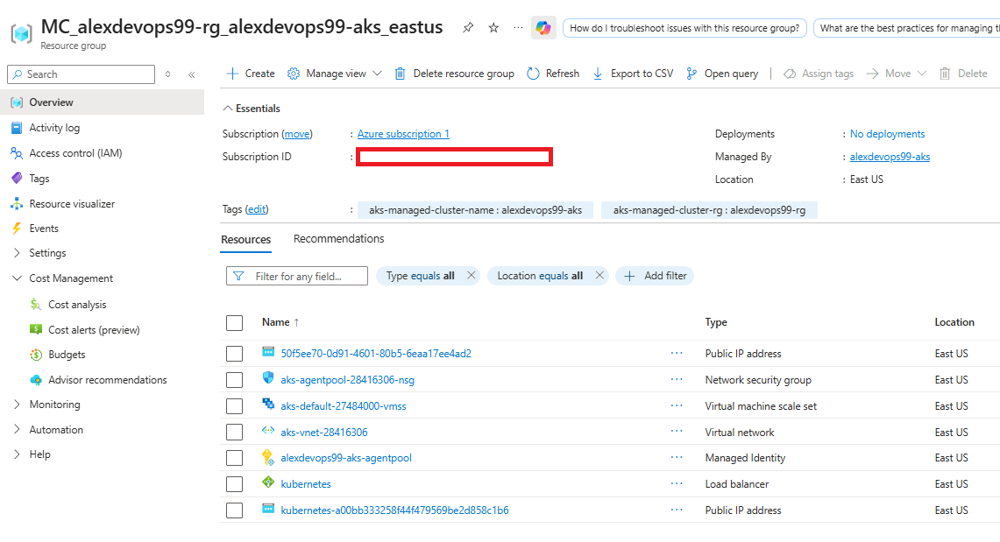
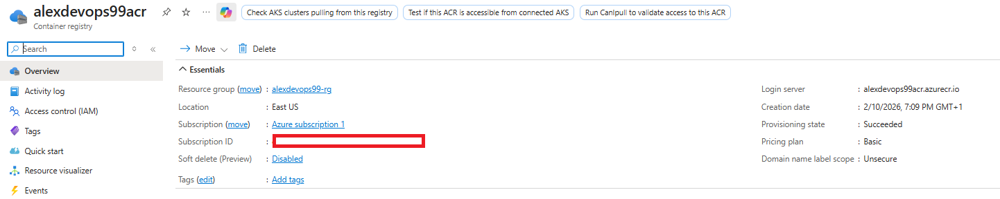
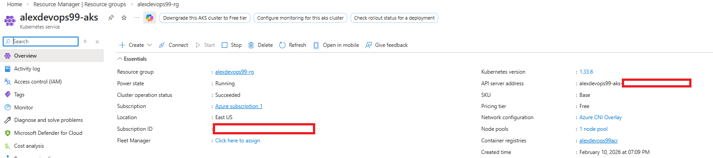

### Kubernetes

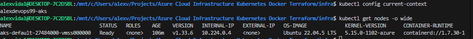
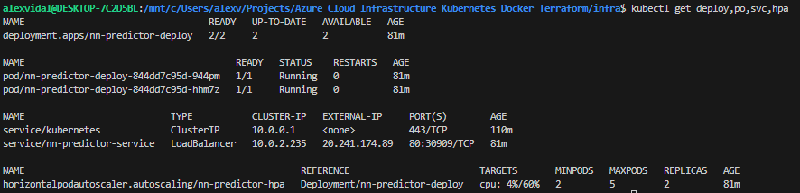
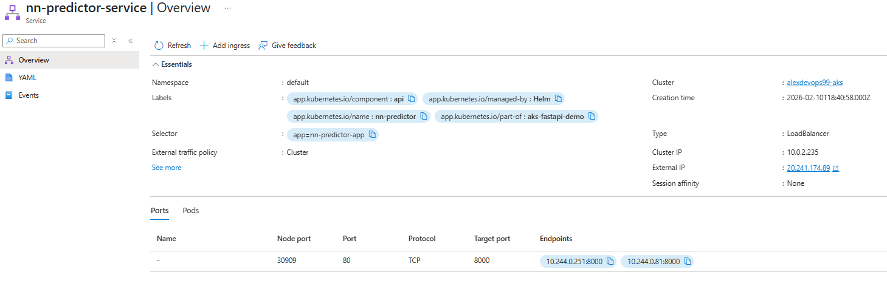

### CI/CD

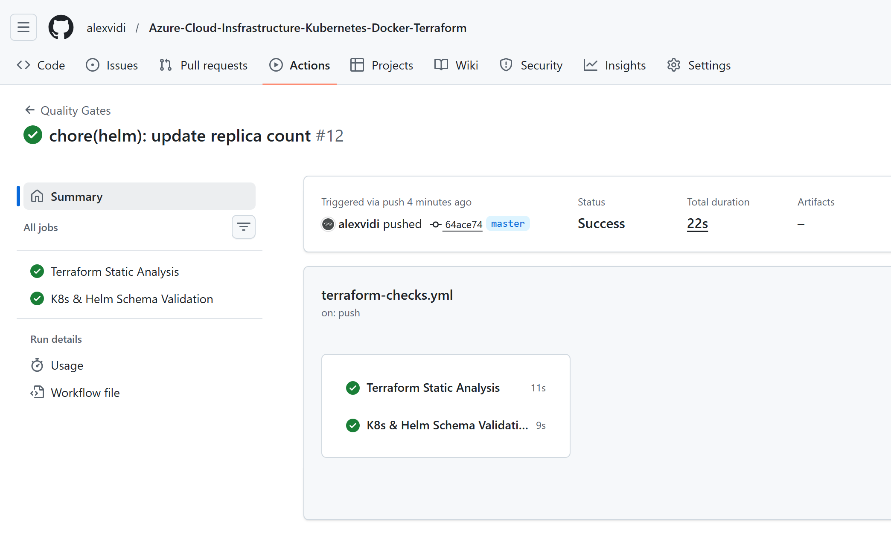

### API

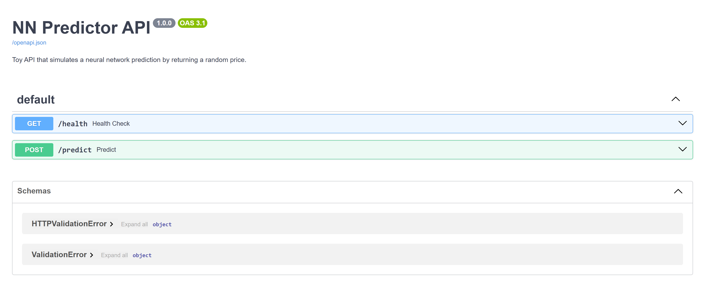
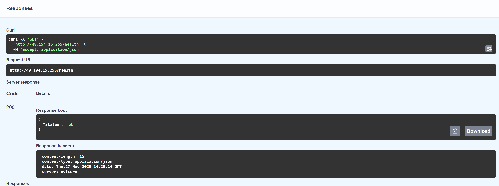
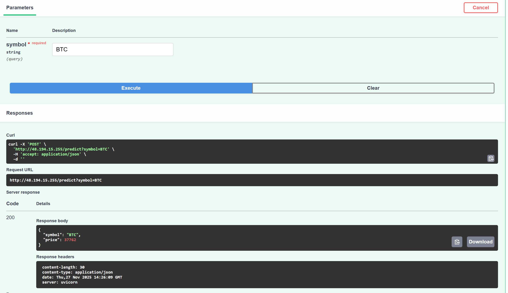

### Observability

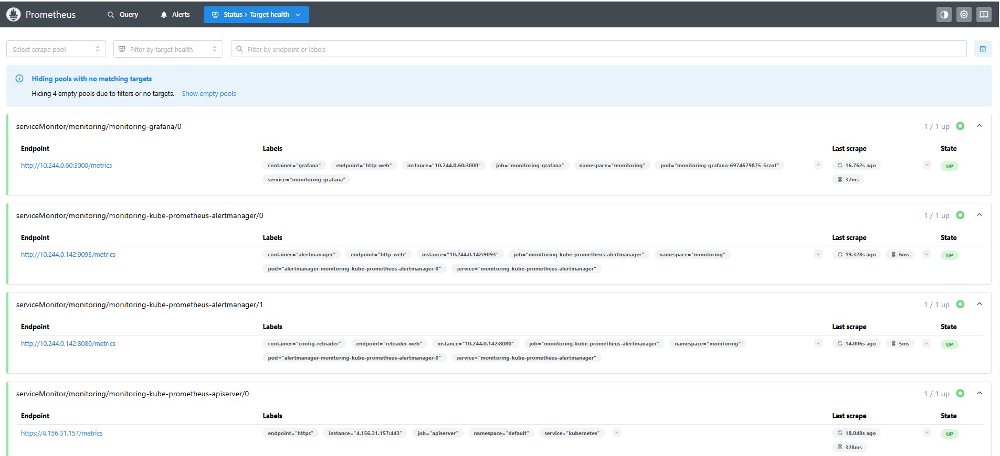

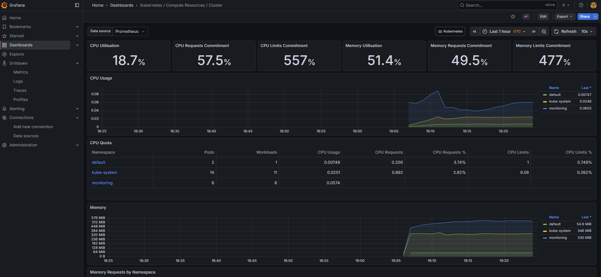
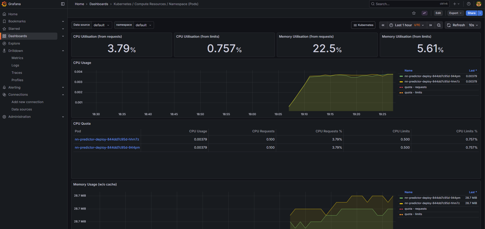
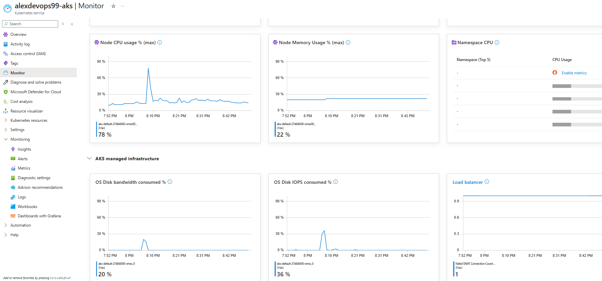

## Author

**Alexandre Vidal**  
Email: alexvidaldepalol@gmail.com  
[LinkedIn](https://www.linkedin.com/in/alexandre-vidal-de-palol-a18538155/)  
[GitHub](https://github.com/alexvidi)
